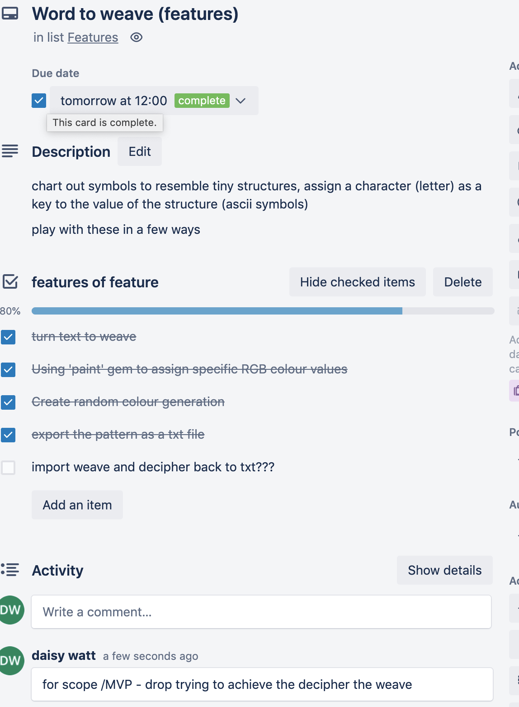
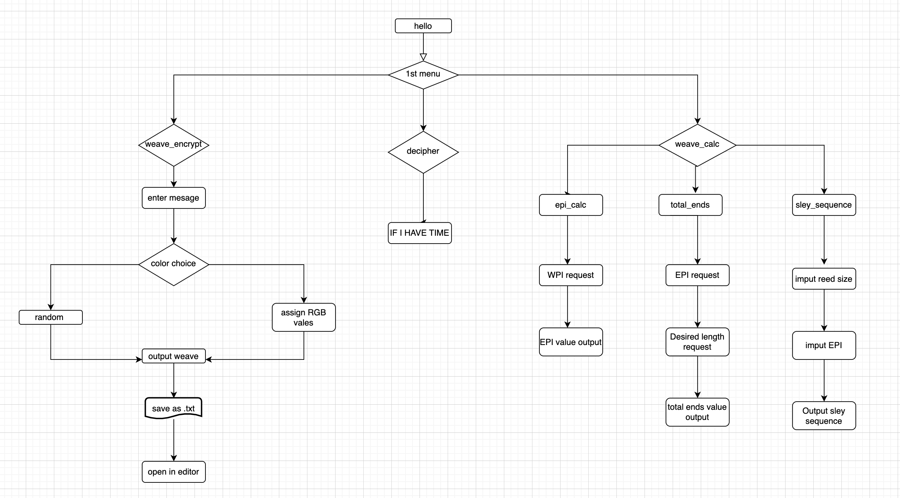

    ,---------------------------,
    |  /---------------------\  |
    | |                       | |
    | |                       | |
    | |    ##....weavemate_94 | |
    | |                       | |
    | |                       | |
    |  \_____________________/  |
    |___________________________|

STATEMENT OF PURPOSE AND SCOPE:

In ten words or less, this application turns words into coloured weave structures. 

The app also has a section dedicated to the tedious yet basic calculations weavers and textile folk need when planning and developing woven work on the loom. Perhaps in the future for weavemate_94 there is potential scope for then ciphering the weave structures back into words. The app also outputs coloured weaves, specifically with precise RGB values. The fashion and textile industry are heavily reliant on precise color matching and utilizes color index libraries such as pantone© - who provide RGB values for their thousands and thousands of colors. It also has a section which performs automated calculations for weave planning and loom set up requirements.

The application has two main parts to it: The weave encryption element, as well as a
weave pocket calculator - There's also a tongue-in-cheek ghost category(deciper_weave) for a potential new feature that was cut from this round of production due to scoping issues. Personally I have been fascinated with data visualization in creative practices and have been eager for the opportunity to be able to actualize something from this intersection of ideas. This application allows me to automate something I have been trying to generate within weaving (up until recently this process was largely graphed out on graph paper and pencils...).

The target audience for this app is broken into two parts; one part focusing on other studio weavers or textile folk who regularly work with looms. They would benefit from the automation of some basic calculations and from the streamlining of accessing their sley sequence specifications for loom set up requirements. The second part of this application's intended targeted audience would be for anyone with a curiosity for weaving and tongue-in-cheek-encryption, it could provide entertainment and indulge cheeky creativity. 

FEATURES DESCRIPTIONS:

- make_weave_encryption:
   - This feature turns written message into a "weave structures"
This is the "main event" of the app, It matches alphabetical characters with their pre assigned structure, producing output within the terminal of a string of those structures - which is just a re-interpretation of the original alphabetical message. It plays with ideas of data visualization and encryption, in a lighthearted way. Through the use of generating a hash filled with assigning individual alphabetic letters as keys to my strings of asci symbols as the values (the weave structures).

Randomize color option feature:
Utilizes the “Paint gem” which allows for RGB value inputs by using the rand method(random selecting) when passing it ranges as its argument for every Red, Green and Blue value for both the "warp"(background) and "weft"(foreground)

       - Precise RGB choice for Warp and Weft of weaves:
Again making use of the ruby gem “paint” to allow us to pass in specific values for RGB requirements. This would allow the user to exactly color match their secret message encryption with their desired color palette.

Output as txt file and Open in text editor:
Once txt (secret message) and color input has been executed, the “encrypted weave” saves as a ‘.txt’ file. With the use of another ruby gem “editor” the user also has the ability to then open the file in a txt editor - this is where I have future plans to expand for the deciphering element to the app. Opening it in a txt editor allows the user to access the output string of asci symbols - weaves.
         
- weave_calculator:
   - epi_calculator:
Is a function that is used to calculate the EPI (Ends Per Inch) for weave planning purposes. This feature takes imput from the user and returns a value. This method takes one argument(The total wraps per inch of the desired thread) and then performs a calculation that produces a return value of 2/3rd of the original value. This value is what is used as the Ends Per Inch value for further use in the warp planning process. In the future it would be great to expand on this and perhaps store these values in some type of a specification file for documentation purposes.

   - total_ends_calculator:
This feature works similar to the epi_calculator, this function is used to calculate the total ends of the entire warp, based on the value from Ends Per Inch. This method performs a simple multiplication calculation that takes two imputs from the user then returns the multiplication outcome of both values. These methods also uses basic type coercion to be able to perform the math function - turning the imput from a string to an integer.           
   - sley_sequence_finder:
This feature gives the user the ability to find the right sequence/setting for the loom they are using, depending on a couple of other variables. Normally this information is stored in a table/chart and is slow to read, this function using keys for keys and values to access the right sequence based on the imput of the user - spitting out the correct sequence/settings for their loom set up. This method pulls information from a JSON file, which has a large hash within a hash.

OUTLINE USER INTERACTIONS/EXPERIENCE:

IMPLEMENTATION PLAN: 

The timeframe and workflow magagement of this project was kept on track with the usgae of Trello's web-based list making application. You can view and access the workspace here https://trello.com/b/0qxbGEJz/t1a3 

Below shows the trello workspace, with sperate piles/stages for: to do, currently working on, resolving in breain, features (for the dev process of fleshing out those features) and a done category:

I added (ambitious) timeframes for individual tasks with the intention of completing the project BEFORE the final due date..:

CONTROL FLOW DIAGRAM:

GITLOG FILES/LINK:

https://github.com/daisy-watt/babys_first_app.git

HELP DOCUMENTATION/INSTALL INSTRUCTIONS:

INSTALLATION INSTRUCTIONS:

-Instal ruby 2.7.4 or later
-Clone/'download' the repository from ths github link: https://github.com/daisy-watt/babys_first_app.git 
-Using the command line in your terminal, change directores into the source folder of the project
-Run the program by entering 'ruby main.rb -mode fun' into the commandline in your terminal.

SYSTEM REQUIREMENTS:

ruby 2.7.4p191 or later
Mac OS or Windows OS 

DEPENDANCIES:

colorize (0.8.1)
paint (2.2.1)
tty-editor  (0.7.0)
tty-prompt (0.23.1)
json (2.6.1) 

TESTING:

-Run the 2 planned tests by entering 'ruby main.rb -mode testy'
-Both tests should return true if the program is good to go, false if there were issues. 

